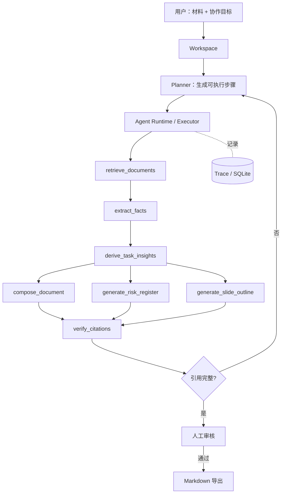

# DocFlow 协作式文档 Agent

面向 Agent 应用工程岗位的作品项目。用户把会议纪要、项目材料或需求文档放入工作区，再以自然语言描述目标；系统将目标拆成可检查的计划，调用真实工具完成检索、事实抽取、文档/清单/汇报大纲生成和引用校验，并完整保留运行轨迹。

> 示例任务：`基于这些材料生成本周项目周报、风险清单和三页汇报大纲；每条结论标注来源。`

## 核心亮点

- **显式 Agent Runtime**：Planner 先生成计划，Executor 按计划从 Tool Registry 选择工具执行；不是把全部材料直接交给模型生成答案。
- **工具化交付**：内置 `retrieve_documents`、`extract_facts`、`derive_task_insights`、`compose_document`、`generate_risk_register`、`generate_slide_outline`、`verify_citations` 七个可独立调用的工具。
- **可观测性**：SQLite 持久化任务、运行、每一步输入摘要、输出摘要、耗时和异常，前端展示 Agent Trace。
- **引用与一致性校验**：周报摘要、进展、风险、行动项与汇报大纲均使用 `[E1]` 等引用标识；Evidence Verifier 同时检查引用可追溯性，并对“待确认”字段与汇报结论矛盾的情况发出人工复核提醒。
- **受约束模型理解**：配置 DeepSeek/OpenAI-compatible API 后，`derive_task_insights` 仅基于系统抽取的事实和证据编号生成周报摘要、风险、行动项与汇报重点；未知负责人或截止时间必须标注“待确认”。
- **Human-in-the-loop**：结果进入人工审核后才允许导出 Markdown；审核状态与备注持久化。
- **兼容真实材料**：支持粘贴文本和 PDF / TXT / Markdown 上传；PDF 提取复用 `pypdf`，扫描件需先 OCR。

## 工作流



## 技术实现

| 模块 | 当前实现 | 面试可讲点 |
| --- | --- | --- |
| 前端工作台 | Vanilla JavaScript + CSS | 工作区任务、Trace 面板、审核与导出状态 |
| API | FastAPI | JSON / 文件上传接口、错误边界、路由分层 |
| Agent Runtime | Python | Planner、Tool Registry、共享运行状态、步骤回调 |
| 证据链 | 本地检索与引用校验 | 事实、引用、产出分离；可追溯而非无依据生成 |
| 持久化 | SQLite | task / run / step 三层数据模型，支持重放与排障 |
| 文档解析 | pypdf | PDF 页文本提取，TXT / Markdown 统一入口 |

## 运行界面会展示什么

1. **执行计划**：根据“表格”“汇报/PPT”等交付目标动态选择工具。
2. **Agent Trace**：每一步工具名、状态、耗时、输出预览和错误信息。
3. **文档产出**：带 `[E#]` 引用的 Markdown 主文档，以及按任务生成的清单和汇报大纲。
4. **引用校验**：引用数量、无效引用列表、对应证据片段。
5. **人工审核**：审核通过后才可下载 Markdown。

## 本地运行

```powershell
python -m venv .venv
.\.venv\Scripts\python.exe -m pip install -r requirements.txt
.\.venv\Scripts\python.exe -m uvicorn app.main:app --host 127.0.0.1 --port 8010
```

打开 `http://127.0.0.1:8010`。

## 验证

```powershell
.\.venv\Scripts\python.exe -m unittest discover -s tests -v
.\.venv\Scripts\python.exe scripts\evaluate_docflow.py
```

当前测试覆盖：原有产业研究卡片能力、Planner 的工具选择、Agent Runtime 的引用产出与 Trace、结构化风险清单字段、SQLite 中任务/运行/步骤持久化；另有 20 条固定任务组成的回归集，检查工具选择和引用校验是否退化。

## 当前边界与后续迭代

- 当前 Agent 将“检索、引用编号、校验、审核”保留为确定性组件，只把材料理解与交付组织交给可配置 LLM；API 失败时自动回退到本地规则，并在页面中标识模式。
- 下一步会补充失败重试、会话记忆与成本面板，让运行策略可配置、可观测。
- 计划补充：失败重试策略、会话记忆、Token/延迟/成本面板、Docker 一键启动、MCP 工具适配示例。

## 项目结构

```text
app/
  main.py                 # FastAPI 与 API 路由
  docflow.py              # Planner、Tool Registry、Agent Runtime、工具实现
  docflow_repository.py   # task/run/step SQLite 持久化
  document_text.py        # PDF/TXT/Markdown 解析
static/                   # 协作工作台与 Trace 可视化
tests/                    # 单元和回归测试
```

项目的工作流、技术实现、验证方式与当前边界均已在本文档中说明。
