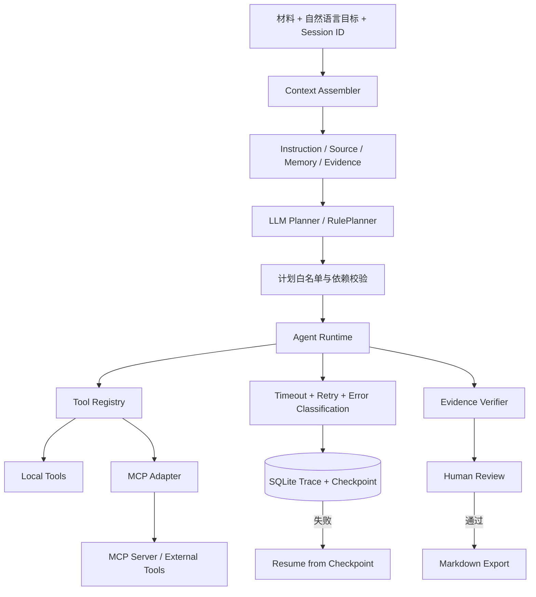

# DocFlow 协作式文档 Agent V2

面向 Agent 应用工程岗位的个人项目。用户输入会议纪要、项目材料或 PDF，并用自然语言描述交付目标；系统通过可校验 Planner、Tool Registry 和 Agent Runtime 完成证据检索、事实抽取、周报/风险清单/汇报大纲生成、引用校验与人工审核，同时保留完整执行轨迹。

> 示例任务：基于材料生成本周项目周报、风险清单和三页汇报大纲；每条结论标注来源。

## 在线演示

公网域名将在完成 TLS 与访问口令配置后补充。发布前不在仓库中保留裸 IP 或未受保护的临时入口。

推荐从左侧业务模板创建任务：首屏使用居中单栏聚焦 Context Engineering 配置与材料输入，提交后自动定位到下方 Run Inspector。结果顶部的运行决策链会用真实任务数据串联计划、执行、证据和人工决策；点击任一阶段即可下钻到 Trace、引用或 Checkpoint 恢复入口。公开面试 Demo 默认采用 RulePlanner 和本地语义规则，并通过访问口令、API 限流、游客会话隔离和审核导出门禁控制使用范围。

## 项目解决的问题

通用大模型直接生成企业文档时，容易出现三个问题：任务拆解不可见、工具失败后需要整次重跑、输出结论缺少可追溯证据。DocFlow 将任务变成受约束的多步执行链，并把计划、工具参数、尝试次数、异常、检查点、引用和人工审核统一纳入运行闭环。

## V2 核心能力

- **安全 Planner**：支持 OpenAI-compatible/DeepSeek 模型规划；计划执行前进行工具白名单、依赖顺序、重复调用和最大步数校验，模型不可用或计划非法时回退到 RulePlanner。
- **可靠执行与恢复**：每个工具配置超时、有限重试与错误分类；按尝试记录 Trace，成功步骤写入 SQLite 检查点，失败任务可从最近成功步骤继续执行。
- **Session Memory**：按 `session_id` 隔离保存协作偏好，并根据当前目标召回；Memory 只影响结构与表达，不作为事实或引用来源。
- **Context Engineering**：将任务指令、工作区材料、Session Memory 与 Evidence Context 分层管理；支持受众、信息焦点、证据预算、记忆开关和引用策略配置，并输出可检查的 Context Manifest。
- **MCP 工具接入**：基于官方 MCP Python SDK 实现 stdio Server 与 Adapter，完成工具发现、Schema 读取和调用；本地检索工具可通过 MCP 替换原 Tool Registry 实现。
- **证据约束与人工审核**：所有文档在数据层保留 `[E#]` 引用；交付物页面默认隐藏技术标记，用户可切换显示并在引用页核对原文。Verifier 分别报告引用可追溯性与规则内容质量，审核通过后才允许下载包含周报、风险清单、汇报大纲和证据附录的 Markdown 产出包。
- **规则内容理解**：规则模式按原文换行与复合分句拆分背景、进展、里程碑、风险和行动项；同一证据内绑定事项、负责人、截止时间与影响，兼容标准字段和常见口语表达。缺失声明不会生成伪实体，未确认提议与材料冲突单独呈现，Prompt Injection 文本会被隔离而不进入业务摘要。
- **能力边界**：任务目标若明确要求当前 Tool Registry 不具备的联网搜索或邮件发送能力，接口返回结构化 422 并列出缺失能力，不执行任务，也不包装成正常完成。
- **可观测与评测**：将真实 Plan、工具步骤、尝试次数、输入输出摘要和耗时渲染为可交互执行链路；固定集评测覆盖工具选择、引用、规则内容质量、延迟与故障恢复。
- **AgentOps 质量门禁**：聚合 SQLite 任务历史中的 Trace、Verifier 和人工审核结果，展示引用通过率、内容质量通过率、工具成功率、审核通过率、重试率、P95 延迟及最近运行诊断；明确区分本地回归指标与生产 SLA。
- **异步任务生命周期**：受控线程池支持任务排队与后台执行，前端轮询展示 `queued → running → awaiting_review/failed` 状态、步骤进度和队列占用；排队任务载荷持久化到 SQLite，服务重启后自动重新入队，同步接口继续保留用于调试。
- **幂等与结构化观测**：异步接口接受 `Idempotency-Key`，相同请求复用已有 Task、内容冲突返回 409；HTTP 与后台任务事件输出 JSON 日志，并通过 `X-Request-ID` 关联请求和任务。
- **任务优先的演示界面**：左侧模板卡片提供明确的“载入”入口和成功反馈；任务创建与运行结果采用统一纵向阅读流，运行完成后自动定位到检查器。最近运行及完整运行记录支持二次确认删除，运行中任务禁止删除。结果页默认隐藏 `[E#]` 标记，审核通过后在结果顶部开放完整产出包下载。

## 架构



## 关键工程实现

| 模块 | 实现 | 可验证点 |
| --- | --- | --- |
| Planner | `RulePlanner`、`OpenAICompatiblePlanner`、`SafePlanner` | 非法工具、错误顺序、重复步骤、超长计划均拒绝执行 |
| Runtime | `ExecutionPolicy`、attempt-level Trace | 瞬时失败自动重试；非瞬时错误快速失败 |
| Recovery | SQLite checkpoint、parent run、next sequence | 失败后新 Run 从上次成功步骤继续，不重复前置步骤 |
| Memory | session 隔离、目标相关召回 | 召回内容仅作为协作偏好传入语义分析模块 |
| Context | 分层上下文、受众/焦点/证据预算配置、Context Manifest | Memory 与事实证据隔离；检索数量受预算约束 |
| MCP | FastMCP Server + stdio ClientSession Adapter | 真实完成 `list_tools` 与 `call_tool`，保留输入 Schema |
| Observability | 交互式执行链路、步骤详情、输入输出摘要 | 可定位具体工具、尝试次数、耗时与失败原因 |
| AgentOps | 运行质量汇总、引用与内容质量门禁、人工审核反馈统计 | 支持从异常任务回跳到具体 Trace；指标口径声明为本地任务历史 |
| Async Jobs | 2 个 Worker、20 个在途任务上限、状态轮询 | HTTP 请求快速返回 Task ID；SQLite 使用 WAL、busy timeout 与独立连接降低并发写冲突 |
| Operations | Request ID、JSON 事件日志、存活/就绪检查 | `/ready` 检查 SQLite、队列与公开运行配置，不暴露密钥 |
| Product UI | 明确可载入的业务模板、最近运行删除、引用显示开关、审核后下载、运行决策链 | 删除需二次确认且运行中任务受保护；证据页与下载文件仍保留完整 Evidence ID |
| Evaluation | 20 条固定任务 + 业务内容回归 + 合成故障场景 | 工具选择、负责人/日期保留、风险覆盖、汇报选材、引用、延迟和重试恢复均可离线回归 |

## 本地运行

```powershell
python -m venv .venv
.\.venv\Scripts\python.exe -m pip install -r requirements.txt
.\.venv\Scripts\python.exe -m uvicorn app.main:app --host 127.0.0.1 --port 8010
```

打开 `http://127.0.0.1:8010`。不配置模型密钥时使用确定性 RulePlanner 和本地语义规则；配置 `.env` 后启用模型规划与受证据约束的内容理解。

面试演示推荐直接运行：

```powershell
.\start-demo.ps1
```

另开一个 PowerShell 执行 `.\check-demo.ps1`，看到 `[PASS]` 后即可按 [DocFlow 面试演示手册](DEMO.md) 完成三分钟演示。

### 受限公网演示

复制 `.env.example` 为 `.env`，设置 `DOCFLOW_DEMO_MODE=true`，并填写强随机的 `DOCFLOW_DEMO_USERNAME` 与 `DOCFLOW_DEMO_PASSWORD`。`compose.public-demo.yml` 默认只绑定 `127.0.0.1:8010`，应通过带 TLS 的反向代理发布，不能直接把应用端口暴露到公网。公开模式还会对 `/api/` 进行单实例内存限流；`/health` 与 `/ready` 保持无认证，供容器和反向代理探活。

带访问口令执行完整冒烟检查：

```powershell
.\check-demo.ps1 -BaseUrl "https://docflow.example.com" -Username "interviewer" -Password "<demo-password>"
```

## 验证

```powershell
# 单元、API、恢复与 MCP 集成测试
.\.venv\Scripts\python.exe -m unittest discover -s tests -v

# 规划、引用、延迟和故障恢复评测
.\.venv\Scripts\python.exe scripts\evaluate_docflow.py

# 通过真实 stdio 传输验证 MCP 工具发现与调用
.\.venv\Scripts\python.exe scripts\mcp_smoke_test.py

# 依赖一致性
.\.venv\Scripts\python.exe -m pip check
```

2026-09-03 本地回归结果：项目测试套件 80 项通过；除 10 次连续运行、6 次并发运行、幂等提交、任务删除、损坏 PDF、Memory、Trace、Checkpoint、审核与导出外，还覆盖显式“风险/行动/本周进展”字段绑定、负责人和日期保留、Verifier 独立缺失检查、访客会话归属隔离、浏览器会话切换以及受限 Demo 访问认证与限流。20/20 固定任务通过，Optional Tool Precision/Recall、Citation Pass Rate 与规则 Content Quality Pass Rate 均为 100%；合成检索故障在第 2 次尝试恢复。以上仅代表当前固定合成回归集，不代表生产准确率。详细口径见 [评测报告](evaluation/reports/docflow-v2-2026-08-07.md)。

## API 摘要

- `POST /api/docflow/tasks`：创建并同步运行协作任务。
- `POST /api/docflow/jobs`：创建后台任务并立即返回 Task ID 与轮询地址。
- `POST /api/docflow/jobs/file`：上传文件并创建后台任务。
- `GET /api/docflow/jobs/{task_id}`：查询排队、执行进度、当前工具及终态。
- `GET /health`：进程存活检查。
- `GET /ready`：SQLite、队列容量与运行模式就绪检查。
- `POST /api/docflow/tasks/{task_id}/retry`：从最近失败检查点恢复。
- `POST /api/docflow/memories`：写入指定会话的协作偏好。
- `GET /api/docflow/memories/{session_id}`：查看会话记忆。
- DocFlow 任务、运行、Memory、审核、删除与导出接口要求 `X-DocFlow-Session`；浏览器会首次访问时生成随机访客会话并保存在本地，模板沿用该会话而不会切换到共享固定 ID。
- `GET /api/docflow/evaluations/summary`：查看本地任务历史的运行质量、质量门禁和最近任务诊断。
- `POST /api/docflow/tasks/{task_id}/review`：人工通过或驳回。
- `GET /api/docflow/tasks/{task_id}/export`：审核通过后导出 Markdown。

## 项目边界

- 当前 20 条数据是固定、合成的回归集，100% 仅表示该集合未回归，不等同于生产准确率。
- 异步执行器仍位于当前应用进程内，适合本地或单实例演示；SQLite 中状态为 `queued` 的任务会在服务重启后自动重新入队，已进入 `running` 的任务因可能存在未确认副作用而标记失败并保留检查点重试入口，不等同于 Celery/Redis 等生产级分布式队列。
- Verifier 分别报告引用存在性、字段一致性和语义支持性；“有引用”不等于“引用支持该结论”，“Verifier 通过”也只代表当前规则未发现异常，不等同于事实完全正确或生产准确率。
- 页面分别展示后端、数据库、模型配置与本次实际执行模式；模型调用失败时会明确标记本地规则降级，不能把降级结果描述为模型输出。
- Session Memory 存储协作偏好，不把历史偏好冒充材料事实。
- MCP 演示覆盖真实协议调用与适配层，尚未接入需要鉴权的第三方生产服务。
- 当前已实现随机浏览器会话隔离、资源归属校验、受限 Demo 访问口令和 API 频率限制；正确配置时 `/ready` 的 `public_demo_safe` 为 `true`。这仍不是账号登录、RBAC、持久化分布式限流或生产级租户隔离，只允许使用脱敏演示数据。
- 当前为单 Agent 的确定性工作流，不宣称多 Agent 协作或通用自主执行能力。
