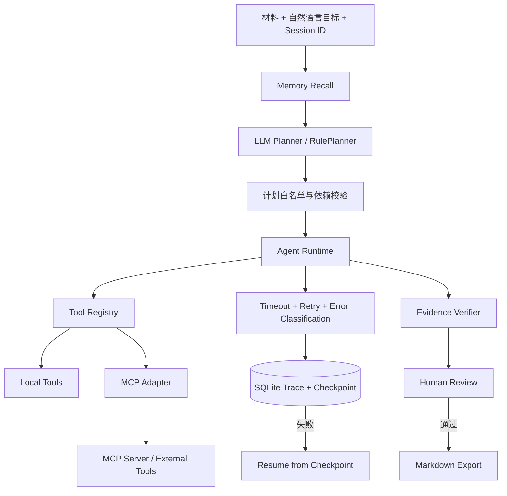

# DocFlow 协作式文档 Agent V2

面向 Agent 应用工程岗位的个人项目。用户输入会议纪要、项目材料或 PDF，并用自然语言描述交付目标；系统通过可校验 Planner、Tool Registry 和 Agent Runtime 完成证据检索、事实抽取、周报/风险清单/汇报大纲生成、引用校验与人工审核，同时保留完整执行轨迹。

> 示例任务：基于材料生成本周项目周报、风险清单和三页汇报大纲；每条结论标注来源。

## 项目解决的问题

通用大模型直接生成企业文档时，容易出现三个问题：任务拆解不可见、工具失败后需要整次重跑、输出结论缺少可追溯证据。DocFlow 将任务变成受约束的多步执行链，并把计划、工具参数、尝试次数、异常、检查点、引用和人工审核统一纳入运行闭环。

## V2 核心能力

- **安全 Planner**：支持 OpenAI-compatible/DeepSeek 模型规划；计划执行前进行工具白名单、依赖顺序、重复调用和最大步数校验，模型不可用或计划非法时回退到 RulePlanner。
- **可靠执行与恢复**：每个工具配置超时、有限重试与错误分类；按尝试记录 Trace，成功步骤写入 SQLite 检查点，失败任务可从最近成功步骤继续执行。
- **Session Memory**：按 `session_id` 隔离保存协作偏好，并根据当前目标召回；Memory 只影响结构与表达，不作为事实或引用来源。
- **MCP 工具接入**：基于官方 MCP Python SDK 实现 stdio Server 与 Adapter，完成工具发现、Schema 读取和调用；本地检索工具可通过 MCP 替换原 Tool Registry 实现。
- **证据约束与人工审核**：所有文档使用 `[E#]` 引用；Verifier 检查引用可追溯性和跨产出一致性，审核通过后才允许导出 Markdown。
- **可观测与评测**：记录 Planner 模式、步骤/尝试级 Trace、延迟、重试次数、Token 估算；固定集评测覆盖工具选择、引用通过率、延迟与故障恢复。

## 架构



## 关键工程实现

| 模块 | 实现 | 可验证点 |
| --- | --- | --- |
| Planner | `RulePlanner`、`OpenAICompatiblePlanner`、`SafePlanner` | 非法工具、错误顺序、重复步骤、超长计划均拒绝执行 |
| Runtime | `ExecutionPolicy`、attempt-level Trace | 瞬时失败自动重试；非瞬时错误快速失败 |
| Recovery | SQLite checkpoint、parent run、next sequence | 失败后新 Run 从上次成功步骤继续，不重复前置步骤 |
| Memory | session 隔离、目标相关召回 | 召回内容仅作为协作偏好传入语义分析模块 |
| MCP | FastMCP Server + stdio ClientSession Adapter | 真实完成 `list_tools` 与 `call_tool`，保留输入 Schema |
| Evaluation | 20 条固定任务 + 合成故障场景 | 工具选择、引用通过率、延迟、重试恢复均可离线回归 |

## 本地运行

```powershell
python -m venv .venv
.\.venv\Scripts\python.exe -m pip install -r requirements.txt
.\.venv\Scripts\python.exe -m uvicorn app.main:app --host 127.0.0.1 --port 8010
```

打开 `http://127.0.0.1:8010`。不配置模型密钥时使用确定性 RulePlanner 和本地语义规则；配置 `.env` 后启用模型规划与受证据约束的内容理解。

## 验证

```powershell
# 单元、API、恢复与 MCP 集成测试
.\.venv\Scripts\python.exe -m unittest discover -s tests -v

# 规划、引用、延迟和故障恢复评测
.\.venv\Scripts\python.exe scripts\evaluate_docflow.py

# 通过真实 stdio 传输验证 MCP 工具发现与调用
.\.venv\Scripts\python.exe scripts\mcp_smoke_test.py

# 依赖一致性
.\.venv\Scripts\python.exe -m pip check
```

2026-08-07 本地规则模式结果：19 项测试通过；20/20 固定任务通过，Optional Tool Precision/Recall 与 Citation Pass Rate 均为 100%；合成检索故障在第 2 次尝试恢复。详细口径见 [评测报告](evaluation/reports/docflow-v2-2026-08-07.md)。

## API 摘要

- `POST /api/docflow/tasks`：创建并运行协作任务。
- `POST /api/docflow/tasks/{task_id}/retry`：从最近失败检查点恢复。
- `POST /api/docflow/memories`：写入指定会话的协作偏好。
- `GET /api/docflow/memories/{session_id}`：查看会话记忆。
- `POST /api/docflow/tasks/{task_id}/review`：人工通过或驳回。
- `GET /api/docflow/tasks/{task_id}/export`：审核通过后导出 Markdown。

## 项目边界

- 当前 20 条数据是固定、合成的回归集，100% 仅表示该集合未回归，不等同于生产准确率。
- 引用校验能验证 Evidence ID 的存在性和部分跨产出一致性，不等同于完整语义蕴含判定。
- Session Memory 存储协作偏好，不把历史偏好冒充材料事实。
- MCP 演示覆盖真实协议调用与适配层，尚未接入需要鉴权的第三方生产服务。
- 当前为单 Agent 的确定性工作流，不宣称多 Agent 协作或通用自主执行能力。
