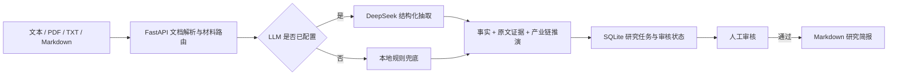

# AI 产业研究助手

面向公司公告、产业材料与宏观材料的证据化 AI 研究工作台。系统将输入材料转化为结构化研究卡片与 Markdown 简报，并要求每条关键结论关联原文证据；它不预测股价，也不提供买卖建议。

> 面向 AI 应用岗位的作品项目：展示从文档解析、LLM 结构化输出，到可审核工作流和结果导出的完整产品闭环。

## 核心亮点

- **证据优先**：每条事实均绑定原文片段和页码/段落位置，区分原文事实与基于事实的产业推演。
- **产业分析而非摘要复述**：输出供需、价格、产能、成本等传导链路，并给出后续验证条件和风险反转因素。
- **可控 Agent 工作流**：采用“生成研究卡片 → 人工审核 → 导出简报”的状态流转，未经审核不能导出。
- **模型可替换**：支持 DeepSeek 的 OpenAI-compatible API；未配置密钥时可使用本地规则模式完成演示。

## 技术架构



## 演示流程

1. 上传一份公司公告、行业报告或产业政策 PDF。
2. 系统识别材料类型，生成带原文证据的事实卡片。
3. 查看产业链推演、验证条件和风险反转条件。
4. 人工审核通过后，导出 Markdown 研究简报。

## 项目目标

本项目用于展示 AI 应用开发能力：文档解析、材料路由、LLM 结构化抽取、证据溯源、状态化 Agent 工作流、人工审核与结果评测。

## 支持的输入

| 材料类型 | 典型输入 | 输出重点 |
| --- | --- | --- |
| 公司 | 公告、财报、业绩会纪要 | 核心事件、财务指标、经营影响 |
| 产业 | 政策、供需、技术与上下游动态 | 产业环节、影响链路、待验证关联 |
| 宏观 | 经济数据、监管政策、利率与汇率材料 | 宏观变化与可能受影响的行业方向 |

## Agent 工作流

```text
输入文本或 PDF
  -> 材料路由：公司 / 产业 / 宏观
  -> 信息抽取：事实、主体、时间、关键指标
  -> 证据校验：每条结论绑定原文片段
  -> 研究分析：影响维度、影响链路、待验证项
  -> 人工审核：通过 / 编辑 / 驳回
  -> 生成研究简报并保存历史记录
```

## MVP 边界

- 支持粘贴文本及上传 PDF、TXT、Markdown 文件。
- 支持三类材料自动路由及不同的结构化抽取模板。
- 只输出“事实、证据、影响维度、待验证项”，不输出价格预测或交易建议。
- 审核通过后才允许导出 Markdown 简报。
- 为关键链路准备样例材料和可复跑验收用例。

详细产品规格见 [docs/product-spec.md](docs/product-spec.md)。

## 本地运行

```powershell
python -m venv .venv
.\.venv\Scripts\python.exe -m pip install -r requirements.txt
.\.venv\Scripts\python.exe -m uvicorn app.main:app --host 127.0.0.1 --port 8010
```

打开 `http://127.0.0.1:8010`，粘贴一段材料即可完成“生成研究卡片 -> 人工审核 -> 导出 Markdown”的闭环。

默认使用本地演示模式，以便无密钥运行和验收。项目默认提供 DeepSeek 的 OpenAI-compatible 配置：将 `.env.example` 复制为 `.env`，只填入 `MODEL_API_KEY` 即可启用 `deepseek-v4-flash`。密钥不会提交到仓库。

模型模式下，系统要求模型将“核心结论”和“影响分析”与“原文证据”分开输出；模型不能脱离上传材料补充事实，也不能生成价格预测或买卖建议。

## 当前验收

- 三类材料路由均有单元测试。
- 已验证产业材料的端到端流程：`industry` 路由、证据卡片、人工通过、Markdown 导出。
- 测试命令：`python -m unittest discover -s tests -v`。
