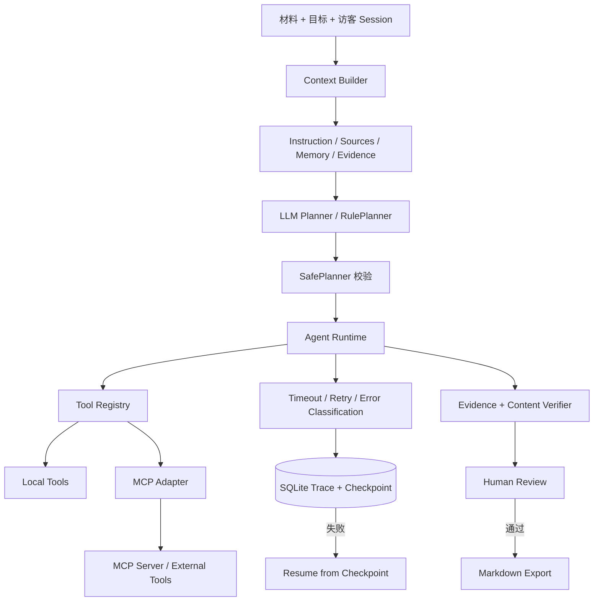

# DocFlow 协作式文档 Agent V2

[](https://github.com/YanCastroJoe/ai-industry-research-assistant/actions/workflows/ci.yml)

> 将会议纪要、项目材料或 PDF 转化为可追溯、可恢复、经人工审核后才能导出的业务文档。

这是一个面向 Agent 应用工程岗位的个人项目。项目重点不是包装一个通用聊天界面，而是实现从上下文组织、受约束规划、工具执行、证据校验到人工审核的完整 Agent 运行闭环。

## 在线登录

- 在线地址：[打开 DocFlow 协作式文档 Agent](https://124.221.243.125/)
- 登录方式：浏览器 HTTP Basic Auth；演示用户名为 `Yancz`，访问口令由本人随简历或面试邀请单独提供，不写入公开仓库。
- 登录范围：同一服务器上的 DocFlow 与 DocsGPT RAG 共用一层演示访问保护。浏览器完成一次登录后可能自动复用凭据，因此切换项目时不一定再次弹出登录框。

登录后可从业务入口创建文档任务并查看生成结果，也可检查 Plan、Trace、Evidence、Checkpoint、Verifier 与人工审核状态。公网实例优先使用 OpenAI-compatible 模型完成规划与内容理解；模型不可用时会显式标记并降级到 RulePlanner 与本地语义规则。实例同时启用 API 限流、随机访客会话隔离和审核导出门禁。

本地启动后访问 `http://127.0.0.1:8010`。推荐演示任务：

```text
基于材料生成本周项目周报、风险清单和三页汇报大纲；每条结论标注来源。
```

## 场景与问题

通用大模型直接生成企业文档时，常见问题包括：

- 任务拆解不可见，无法确认模型准备调用哪些工具。
- 中间步骤失败后只能整次重跑，已完成结果不能复用。
- 结论缺少可核对来源，“存在引用”也不代表引用支持结论。
- 历史偏好容易与业务事实混在一起，造成跨任务或跨用户污染。
- 文档生成完成后直接交付，缺少明确的人工审核和导出门禁。

DocFlow 将一次文档任务拆成受约束的执行链，并把计划、工具参数、尝试次数、检查点、证据、内容质量校验和人工决策统一记录到 SQLite。

## 解决方案与系统架构



系统遵循 `Context Builder → SafePlanner → Tool Registry → Agent Runtime → Verifier → Human Review` 主链路。Memory 只能改变表达重点和章节顺序，不能成为事实、负责人、日期或 Evidence 的来源。

## 个人工作与工程亮点

| 方向 | 实现内容 | 可验证结果 |
| --- | --- | --- |
| 安全规划 | 实现 `RulePlanner`、`OpenAICompatiblePlanner` 与 `SafePlanner`，校验工具白名单、依赖顺序、重复调用和最大步数 | 非法工具、错误顺序、重复步骤和超长计划会在执行前被拒绝 |
| 可靠执行 | 为工具调用增加超时、有限重试、错误分类、attempt-level Trace 与 SQLite Checkpoint | 瞬时故障可重试，失败任务可从最近成功步骤继续，不重复执行前置步骤 |
| Context Engineering | 分层管理任务指令、工作材料、Session Memory 与 Evidence Context，并输出 Context Manifest | 可配置受众、关注重点、证据预算、记忆开关和引用策略 |
| Session Memory | 按访客 Session 隔离保存偏好，采用相关性阈值召回并记录 recalled/applied 状态 | 相同事实下可改变报告组织方式，同时不会进入 Evidence 或引用来源 |
| MCP 接入 | 基于官方 MCP Python SDK 实现 stdio Server 与 Adapter | 真实完成工具发现、Schema 读取和 `call_tool`，不是接口占位 |
| 证据与审核 | 数据层保留 `[E#]`，界面默认隐藏技术标记；Verifier 分开检查引用可追溯性和内容质量 | 审核前导出返回 409，审核通过后才开放完整 Markdown 产出包 |
| 异步与可观测性 | 实现任务队列、幂等键、结构化日志、Request ID、运行进度和 AgentOps 指标 | 支持 `queued → running → awaiting_review/failed` 生命周期和运行诊断 |
| 公网演示安全 | 随机浏览器 Session、资源归属校验、访问口令、限流和就绪检查 | 不同访客不能读取、审核、删除或导出彼此的任务与 Memory |

## 关键问题与修复

| 问题 | 根因 | 修复与回归 |
| --- | --- | --- |
| 显式“风险/行动/本周进展”被错误分类 | 清洗阶段丢失字段标签，生成器与 Verifier 又依赖同一解析结果 | 保留原始标签语义，独立从原始材料检查风险、负责人和日期是否进入产物 |
| Memory 已召回但规则结果完全相同 | fallback 只记录 Memory 数量，没有实际应用偏好 | 将自然语言偏好映射为 risk/progress/actions/balanced，并分别记录召回和应用范围 |
| 工具失败后重复执行所有步骤 | 运行状态只保留最终结果，没有可恢复检查点 | 按步骤写入 Checkpoint，使用 parent run 和 next sequence 从失败点恢复 |
| “有引用”被误判为“内容正确” | 只校验 Evidence ID 是否存在 | 将引用存在性、字段一致性和语义支持性拆开报告；删除关键风险或负责人时整体门禁失败 |
| 公网访客可能共享默认 Session | 前端使用固定 Session ID，接口缺少资源归属校验 | 首次访问生成随机访客 Session，并在任务、Memory、审核、删除和导出接口校验归属 |

这些修复均通过通用解析或资源归属规则实现，没有针对单条演示材料硬编码答案。

## 评测与验证

```powershell
# 单元、API、恢复、安全与 MCP 集成测试
.\.venv\Scripts\python.exe -m unittest discover -s tests -v

# 规划、引用、内容质量、延迟和故障恢复评测
.\.venv\Scripts\python.exe scripts\evaluate_docflow.py

# 通过真实 stdio 传输验证 MCP 工具发现与调用
.\.venv\Scripts\python.exe scripts\mcp_smoke_test.py

# 依赖一致性
.\.venv\Scripts\python.exe -m pip check

# M2：60 组模型/规则受控配对 A/B（需配置模型）
.\.venv\Scripts\python.exe -X utf8 scripts\evaluate_model_rules_ab.py --cases evaluation\docflow_model_rules_ab_cases_60.json --mode paired --require-m2-suite --output evaluation\reports\docflow-model-rules-m2-cloud.json

# M3：强制真实模型路径并校验阶段诊断、Token 与成本覆盖
.\.venv\Scripts\python.exe -X utf8 scripts\check_model_runtime.py
```

2026-09-04 回归与云端验收结果：

- DocFlow 测试套件：102 项通过。
- 固定合成任务：20/20 通过。
- M2 受控配对 A/B：模型模式 60/60、规则模式 60/60；60 对输入与 Evidence 一致，模型路径 0 次降级、0 次重试。
- M2 模型路径完成 120 次真实调用，共记录 116,006 Tokens；P50 4.45 秒、P95 5.79 秒。规则路径 P50 2.59 ms、P95 3.76 ms；因未配置单价，不报告估算成本。
- 覆盖 10 次连续运行、6 次并发运行、幂等提交、任务删除、损坏 PDF、Memory、Trace、Checkpoint、审核与导出。
- 覆盖显式风险/行动/进展字段绑定、负责人和日期保留、Verifier 独立缺失检查、访客会话隔离、认证与限流。
- 合成检索故障在第 2 次尝试恢复。
- 云端隔离实例与正式实例分别通过一次强制模型验收：Planner 和内容生成均返回提供方请求 ID、Token 与模型耗时，未发生规则降级；审核前导出受阻，审核通过后导出成功。
- M3 诊断页按当前访客 Session 展示终态任务成功率、模型降级/重试率、总耗时与模型耗时 P50/P95、Planner/内容理解分阶段调用、Token 和计价覆盖；成本仅在完整配置费率时汇总，并保留费率标签与缓存命中/未命中口径。
- 公网入口未认证返回 HTTP 401，认证后首页与 `/ready` 均返回 HTTP 200。

上述结果只代表当前固定合成回归集和云端受控配对验收，不代表生产准确率或 SLA；两条路径在工程硬门禁下打平，尚未采集真人盲评偏好和人工修改率。详细口径见 [固定集评测报告](evaluation/reports/docflow-v2-2026-08-07.md)、[真实模型运行验收](evaluation/reports/docflow-model-runtime-2026-09-04.md) 与 [M2 配对评测报告](evaluation/reports/docflow-model-rules-m2-2026-09-04.md)。

## 本地复现

```powershell
python -m venv .venv
.\.venv\Scripts\python.exe -m pip install -r requirements.txt
.\.venv\Scripts\python.exe -m uvicorn app.main:app --host 127.0.0.1 --port 8010
```

不配置模型密钥时使用确定性 RulePlanner 和本地语义规则；配置 `.env` 后启用模型规划与受证据约束的内容理解。面试演示也可以直接运行：

```powershell
.\start-demo.ps1
.\check-demo.ps1
```

检查通过后，可按 [DocFlow 三分钟演示手册](DEMO.md) 展示完整链路。

若已配置模型，使用强制模型验收，任何 Planner 或内容生成降级都会令检查失败：

```powershell
.\check-demo.ps1 -RequireModel
```

每次真实调用会记录阶段、模型名、提供方请求 ID、Token、模型耗时和可选成本估算；不记录 API Key。配置和验收口径见 [模型运行与验收](docs/model-runtime.md)。

Linux/云服务器可用同一套严格口径验收；密码只从环境变量读取，不进入命令行参数：

```bash
export DOCFLOW_BASE_URL="https://docflow.example.com"
export DOCFLOW_DEMO_USERNAME="interviewer"
read -s -p "DocFlow password: " DOCFLOW_DEMO_PASSWORD; echo
export DOCFLOW_DEMO_PASSWORD
python3 scripts/check_model_runtime.py
```

### 受限公网演示

复制 `.env.example` 为 `.env`，设置 `DOCFLOW_DEMO_MODE=true`，并填写强随机的 `DOCFLOW_DEMO_USERNAME` 与 `DOCFLOW_DEMO_PASSWORD`。`compose.public-demo.yml` 默认只绑定 `127.0.0.1:8010`，必须通过带 TLS 的反向代理发布，不能直接暴露应用端口。

```powershell
.\check-demo.ps1 -BaseUrl "https://docflow.example.com" -Username "interviewer" -Password "<demo-password>"
.\check-demo.ps1 -BaseUrl "https://docflow.example.com" -Username "interviewer" -Password "<demo-password>" -RequireModel
```

<details>
<summary>主要 API</summary>

- `POST /api/docflow/tasks`：同步创建并运行任务。
- `POST /api/docflow/jobs`：创建后台任务并返回 Task ID。
- `GET /api/docflow/jobs/{task_id}`：查询进度、当前工具和终态。
- `POST /api/docflow/tasks/{task_id}/retry`：从最近失败检查点恢复。
- `POST /api/docflow/memories`：写入当前会话的协作偏好。
- `GET /api/docflow/evaluations/summary`：查看本地运行质量与最近诊断。
- `POST /api/docflow/tasks/{task_id}/review`：人工通过或驳回。
- `GET /api/docflow/tasks/{task_id}/export`：审核通过后导出 Markdown。
- `GET /health` 与 `GET /ready`：存活和运行模式检查。

任务、运行、Memory、审核、删除与导出接口均要求 `X-DocFlow-Session`。

</details>

## 项目边界

- 20 条任务是固定合成回归集，100% 仅表示该集合未回归，不等同于生产准确率。
- 本地无法访问模型服务时会明确降级为 `rules_fallback`，不能把规则结果描述成大模型效果。
- Verifier 通过只表示当前规则未发现异常，不保证事实完全正确，因此仍保留 Human Review。
- 异步执行器位于当前应用进程内，适合本地或单实例演示，不等同于生产级分布式队列。
- Session Memory 是表达偏好，不是事实知识库。
- MCP 演示验证了真实协议调用与适配层，尚未接入需要鉴权的第三方生产服务。
- 当前安全措施适用于脱敏、低频面试演示，不等同于完整登录、RBAC、分布式限流或生产级租户隔离。
- 当前为单 Agent 的确定性工作流，不宣称多 Agent 协作或通用自主执行能力。

## 项目归属与 License

DocFlow 的应用代码、测试、演示界面与文档均作为个人 Agent 工程项目维护。开源许可见 [LICENSE](LICENSE)。
